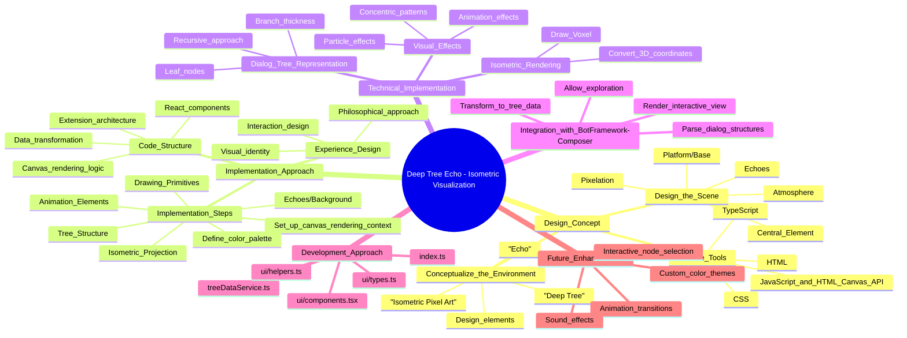

```mermaid
mindmap
  root((Deep Tree Echo - Isometric Visualization))
    Design_Concept
      Conceptualize_the_Environment
        "Deep Tree"
        "Echo"
        "Isometric Pixel Art"
        Design_elements
      Choose_Tools
        HTML
        CSS
        JavaScript_and_HTML_Canvas_API
        TypeScript
      Design_the_Scene
        Central_Element
        Echoes
        Platform/Base
        Atmosphere
        Pixelation
    Implementation_Approach
      Implementation_Steps
        Set_up_canvas_rendering_context
        Define_color_palette
        Isometric_Projection
        Drawing_Primitives
        Tree_Structure
        Echoes/Background
        Animation_Elements
      Code_Structure
        Extension_architecture
        React_components
        Canvas_rendering_logic
        Data_transformation
      Experience_Design
        Philosophical_approach
        Visual_identity
        Interaction_design
    Technical_Implementation
      Isometric_Rendering
        Convert_3D_coordinates
        Draw_Voxel
      Dialog_Tree_Representation
        Recursive_approach
        Branch_thickness
        Leaf_nodes
      Visual_Effects
        Particle_effects
        Concentric_patterns
        Animation_effects
    Integration_with_BotFramework-Composer
      Parse_dialog_structures
      Transform_to_tree_data
      Render_interactive_view
      Allow_exploration
    Development_Approach
      index.ts
      treeDataService.ts
      ui/components.tsx
      ui/helpers.ts
      ui/types.ts
    Future_Enhancements
      Animation_transitions
      Interactive_node_selection
      Sound_effects
      Custom_color_themes
```